# ts-algochat: High-Level Design

This document describes how `@corvidlabs/ts-algochat` (version 0.6.1) works, end to end. It is written from the source in [`src/`](../src/index.ts), the SpecSync contract in [`specs/algochat/`](../specs/algochat/algochat.spec.md), the conformance suite in [`conformance/`](../conformance/README.md) and the workflows in `.github/workflows/`. Where the code does not settle a question, the text says **Unknown**.

The protocol itself is specified in [CorvidLabs/protocol-algochat](https://github.com/CorvidLabs/protocol-algochat). This page covers this implementation of it.

## Contents

1. [Purpose](#1-purpose)
2. [Context](#2-context)
3. [Components](#3-components)
4. [Protocol implementation](#4-protocol-implementation)
5. [Key flows](#5-key-flows)
6. [Data](#6-data)
7. [Runtime and deployment](#7-runtime-and-deployment)
8. [Security and trust boundaries](#8-security-and-trust-boundaries)
9. [Failure modes and limits](#9-failure-modes-and-limits)
10. [Decisions](#10-decisions)
11. [Glossary](#11-glossary)

## 1. Purpose

ts-algochat is the TypeScript implementation of AlgoChat, an end-to-end encrypted messaging protocol that uses the Algorand blockchain as its only transport. Application developers embed it in browser, Bun or Node.js apps. It turns a 25-word Algorand mnemonic into a chat identity, finds a correspondent's encryption key from their on-chain history, encrypts each message into a compact binary envelope that fits in a payment transaction's 1,024-byte note, signs and submits that payment, and later rebuilds and decrypts conversations from the indexer. It adds an optional pre-shared-key (PSK) mode for defense in depth, an offline send queue and background sync. It protects message content. It does not hide who talks to whom, or when, because that metadata is public on chain ([spec invariant 10](../specs/algochat/algochat.spec.md)).

## 2. Context

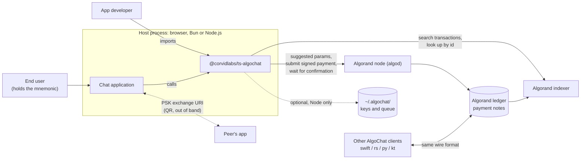

- **algod and indexer** are the only network services the SDK talks to. [`AlgorandService`](../src/services/algorand.service.ts) builds `algosdk.Algodv2` and `algosdk.Indexer` clients from an `AlgorandConfig` (`algodServer`, `algodToken`, `indexerServer`, `indexerToken`, optional ports) that the caller supplies. The [`localnet()`, `testnet()` and `mainnet()`](../src/blockchain/types.ts) helpers return AlgoKit LocalNet or public Nodely endpoints, overridable with `ALGOCHAT_ALGOD_URL`, `ALGOCHAT_ALGOD_TOKEN`, `ALGOCHAT_INDEXER_URL` and `ALGOCHAT_INDEXER_TOKEN`. They return the differently shaped `BlockchainConfig` (`algodUrl`, `indexerUrl`), so an app maps the fields itself before constructing the service.
- **The ledger** holds every message, key announcement and key-publish transaction permanently. There is no smart contract, box or off-chain relay: [spec invariant 12](../specs/algochat/algochat.spec.md) limits delivery to payment notes.
- **Other implementations** ([swift-algochat](https://github.com/CorvidLabs/swift-algochat), [rs-algochat](https://github.com/CorvidLabs/rs-algochat), [py-algochat](https://github.com/CorvidLabs/py-algochat), [kt-algochat](https://github.com/CorvidLabs/kt-algochat)) interoperate through the same bytes. The [conformance vectors](../conformance/README.md) pin those bytes.
- **The file system** is used only by the Node-only storage classes ([`FileKeyStorage`](../src/storage/file-key-storage.ts), [`FileSendQueueStorage`](../src/queue/file-send-queue-storage.ts)).

## 3. Components

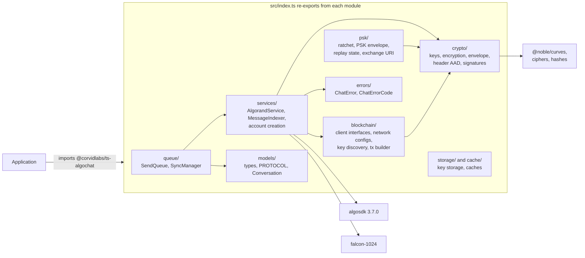

| Module | Owns | Key files |
|---|---|---|
| `services/` | The high-level API. `AlgorandService` sends, replies, fetches messages and conversations, publishes and discovers keys, and waits for confirmation or indexing. `MessageIndexer` offers paginated history reads. `mnemonic.service` creates `ChatAccount`s. | [`algorand.service.ts`](../src/services/algorand.service.ts), [`MessageIndexer.ts`](../src/services/MessageIndexer.ts), [`mnemonic.service.ts`](../src/services/mnemonic.service.ts) |
| `crypto/` | Standard protocol cryptography: X25519 key derivation, ChaCha20-Poly1305 envelope encryption with bidirectional decryption, the 126-byte envelope codec, header AAD, Ed25519 key-announcement signatures and fingerprints. | [`keys.ts`](../src/crypto/keys.ts), [`encryption.ts`](../src/crypto/encryption.ts), [`envelope.ts`](../src/crypto/envelope.ts), [`aad.ts`](../src/crypto/aad.ts), [`signature.ts`](../src/crypto/signature.ts) |
| `psk/` | PSK v1.1: the two-level ratchet, hybrid key derivation, the 130-byte PSK envelope, replay-window state and `algochat-psk://` exchange URIs. Pure functions; no network. | [`ratchet.ts`](../src/psk/ratchet.ts), [`encryption.ts`](../src/psk/encryption.ts), [`envelope.ts`](../src/psk/envelope.ts), [`state.ts`](../src/psk/state.ts), [`exchange.ts`](../src/psk/exchange.ts) |
| `blockchain/` | SDK-agnostic `AlgodClient` / `IndexerClient` interfaces, network presets, standalone key discovery (`discoverEncryptionKey`, `parseKeyAnnouncement`), plus an unsigned-transaction builder and an interface-based message indexer. | [`interfaces.ts`](../src/blockchain/interfaces.ts), [`types.ts`](../src/blockchain/types.ts), [`discovery.ts`](../src/blockchain/discovery.ts), [`message-transaction.ts`](../src/blockchain/message-transaction.ts), [`message-indexer.ts`](../src/blockchain/message-indexer.ts) |
| `queue/` | Offline delivery. `SendQueue` holds pending messages with bounded retries. `SyncManager` drains the queue and polls known conversations on a timer. | [`SendQueue.ts`](../src/queue/SendQueue.ts), [`SyncManager.ts`](../src/queue/SyncManager.ts), [`file-send-queue-storage.ts`](../src/queue/file-send-queue-storage.ts) |
| `models/` | Shared types (`ChatEnvelope`, `Message`, `DiscoveredKey`, `PendingMessage`, `SendOptions`), the `PROTOCOL` constants and the `Conversation` class. | [`types.ts`](../src/models/types.ts), [`Conversation.ts`](../src/models/Conversation.ts) |
| `storage/`, `cache/` | `EncryptionKeyStorage` (in-memory and password-encrypted file), a TTL `PublicKeyCache`, and `MessageCache`. `cache/` holds an older cache API kept for compatibility (`LegacyMessageCache`). | [`storage/index.ts`](../src/storage/index.ts), [`file-key-storage.ts`](../src/storage/file-key-storage.ts), [`cache/index.ts`](../src/cache/index.ts) |
| `errors/` | `ChatError` with a stable `ChatErrorCode`, plus `isChatError` and `wrapError`. | [`ChatError.ts`](../src/errors/ChatError.ts) |

Not everything in `src/` is reachable from the package entry point. `package.json` declares a single export (`.`). These are **not** re-exported from [`src/index.ts`](../src/index.ts): `MessageTransaction`, `MessageTooLargeError`, `MAX_NOTE_SIZE`, `MINIMUM_PAYMENT`, the interface-based `blockchain/MessageIndexer` and its `PublicKeyNotFoundError`, `x25519ECDH`, the header-AAD helpers, and the Node-only `FileKeyStorage` and `FileSendQueueStorage`. Source comments point to a `ts-algochat/node` subpath for the Node-only classes. **Unknown:** that subpath is not declared in `package.json`, so it is not clear how consumers are meant to import them today.

## 4. Protocol implementation

### 4.1 Accounts and keys

A `ChatAccount` ([`algorand.service.ts`](../src/services/algorand.service.ts)) has two independent key roles: an **encryption key pair** (X25519) and a **payment signer** (Ed25519 `sig` or Falcon-1024 `pqsig`). Both come from the same mnemonic.

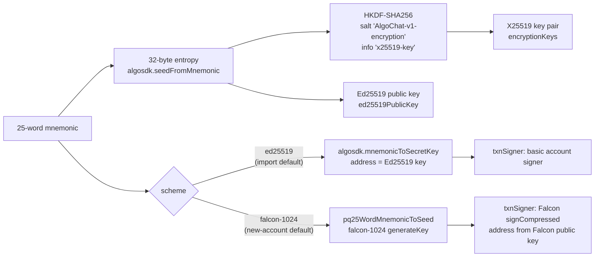

- [`deriveEncryptionKeys`](../src/crypto/keys.ts) always uses mnemonic entropy, never a Falcon secret-key prefix. The same words therefore give the same X25519 key under both schemes but **different addresses** ([spec invariant 11](../specs/algochat/algochat.spec.md)).
- [`createRandomChatAccount()`](../src/services/mnemonic.service.ts) defaults to Falcon-1024. `createChatAccountFromMnemonic(words)` defaults to Ed25519 so a classical phrase recovers the same address as other Algorand wallets. Pass `{ scheme: 'falcon-1024' }` to recover a Falcon account.
- A Falcon account has no `account` field. Its private key lives only inside the `txnSigner` closure.

### 4.2 Standard envelope (protocol `0x01`)

Every standard message gets a fresh ephemeral X25519 key pair and a random 12-byte nonce ([`encryptMessage`](../src/crypto/encryption.ts)). The sender also wraps the message key for itself, so a sender can read its own sent history (bidirectional decryption).

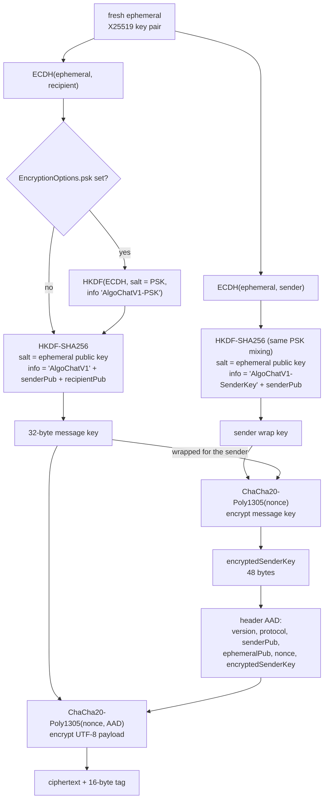

Wire layout ([`envelope.ts`](../src/crypto/envelope.ts), [`aad.ts`](../src/crypto/aad.ts)):

| Offset | Size | Field |
|---|---|---|
| 0 | 1 | `version`: `0x02` (`VERSION_AAD`, written since 0.6.1) or `0x01` (legacy, still decrypted) |
| 1 | 1 | `protocolId`: `0x01` |
| 2 | 32 | sender X25519 public key |
| 34 | 32 | ephemeral X25519 public key |
| 66 | 12 | nonce |
| 78 | 48 | `encryptedSenderKey` (32-byte key + 16-byte tag) |
| 126 | n + 16 | ciphertext + Poly1305 tag |

- For `version 0x02`, the whole 126-byte header is the AEAD associated data. Rewriting any header byte, including `0x02` to `0x01`, makes decryption fail ([`decryptCiphertextWithHeaderAAD`](../src/crypto/encryption.ts)). `version 0x01` envelopes decrypt without AAD so old history stays readable.
- [`decryptMessage`](../src/crypto/encryption.ts) picks the path by comparing the caller's public key with `senderPublicKey` in constant time ([`uint8ArrayEquals`](../src/crypto/keys.ts)). The recipient path re-derives the message key from ECDH. The sender path unwraps `encryptedSenderKey` first.
- The plaintext is UTF-8. A reply is JSON `{"text", "replyTo": {"txid", "preview"}}` with the preview cut to 80 characters ([`encryptReply`](../src/crypto/encryption.ts)). A payload of `{"type":"key-publish"}` decrypts to `null`. Anything else that is not JSON with a `text` string is treated as plain text.
- The plaintext limit is `PROTOCOL.MAX_PAYLOAD_SIZE` = 882 bytes, so the largest envelope is 126 + 882 + 16 = 1,024 bytes, exactly Algorand's note limit.

### 4.3 PSK: two different mechanisms

The code has two ways to mix a pre-shared key into encryption. They are easy to confuse:

| | Standard envelope + `EncryptionOptions.psk` | PSK v1.1 protocol (`0x02`) |
|---|---|---|
| Code | [`crypto/encryption.ts`](../src/crypto/encryption.ts) `deriveIKM` | [`psk/`](../src/psk/index.ts) |
| Envelope | protocol `0x01`, 126-byte header | protocol `0x02`, 130-byte header with a 4-byte big-endian ratchet counter at offset 2 |
| Key material | `ikm = HKDF(ECDH, salt = PSK, info 'AlgoChatV1-PSK')`, then the standard HKDF | `HKDF(ECDH ‖ positionPSK, salt = ephemeralPub, info 'AlgoChatV1-PSK' ‖ senderPub ‖ recipientPub)`. The sender wrap key uses info `'AlgoChatV1-PSK-SenderKey' ‖ senderPub` |
| Ratchet | none: the same 32-byte PSK for every message | `sessionPSK = HKDF(initialPSK, salt 'AlgoChat-PSK-Session', info = uint32BE(counter / 100))`, then `positionPSK = HKDF(sessionPSK, salt 'AlgoChat-PSK-Position', info = uint32BE(counter % 100))` |
| Replay control | on-chain transaction uniqueness only | `validateCounter` / `recordReceive`: reject seen counters and counters outside `peerLastCounter ± 200` |
| Plaintext limit | 882 bytes | 878 bytes |
| Used by `AlgorandService` | yes: one PSK passed to the constructor applies to every send and fetch of that service | **no**: `isChatMessage` only accepts protocol `0x01`, so the service skips PSK v1.1 notes. Apps compose the low-level functions and their own transport |

Both PSK envelope versions follow the same AAD rule as the standard envelope: `0x02` binds the 130-byte header, `0x01` is legacy.

PSK keys are shared out of band as `algochat-psk://v1?addr=<address>&psk=<base64url>&label=<label>` ([`exchange.ts`](../src/psk/exchange.ts)). The parser requires `addr` and a 32-byte `psk`.

### 4.4 Key announcements

A correspondent's X25519 key is found in their own transactions ([`discovery.ts`](../src/blockchain/discovery.ts), `paginatedKeyDiscovery` in [`algorand.service.ts`](../src/services/algorand.service.ts)):

| Note on a self-payment (sender = receiver) | Meaning | Result |
|---|---|---|
| 96 bytes: X25519 key ‖ Ed25519 signature over it | Signed announcement, written by `publishKey` for Ed25519 accounts since 0.6.1 | `isVerified: true` if the signature checks against the address's Ed25519 key. A bad signature is discarded, never downgraded to unverified |
| 32 bytes: X25519 key | Unsigned announcement | Trust-on-first-use candidate, `isVerified: false` |
| A chat envelope in any transaction the address sent | `senderPublicKey` in the header | Trust-on-first-use candidate, `isVerified: false` |

Falcon accounts publish a self-encrypted `{"type":"key-publish"}` envelope instead, because a Falcon address is not an Ed25519 key and cannot verify an Ed25519 signature. Their keys are always discovered as unverified.

## 5. Key flows

### 5.1 Publish and discover an encryption key

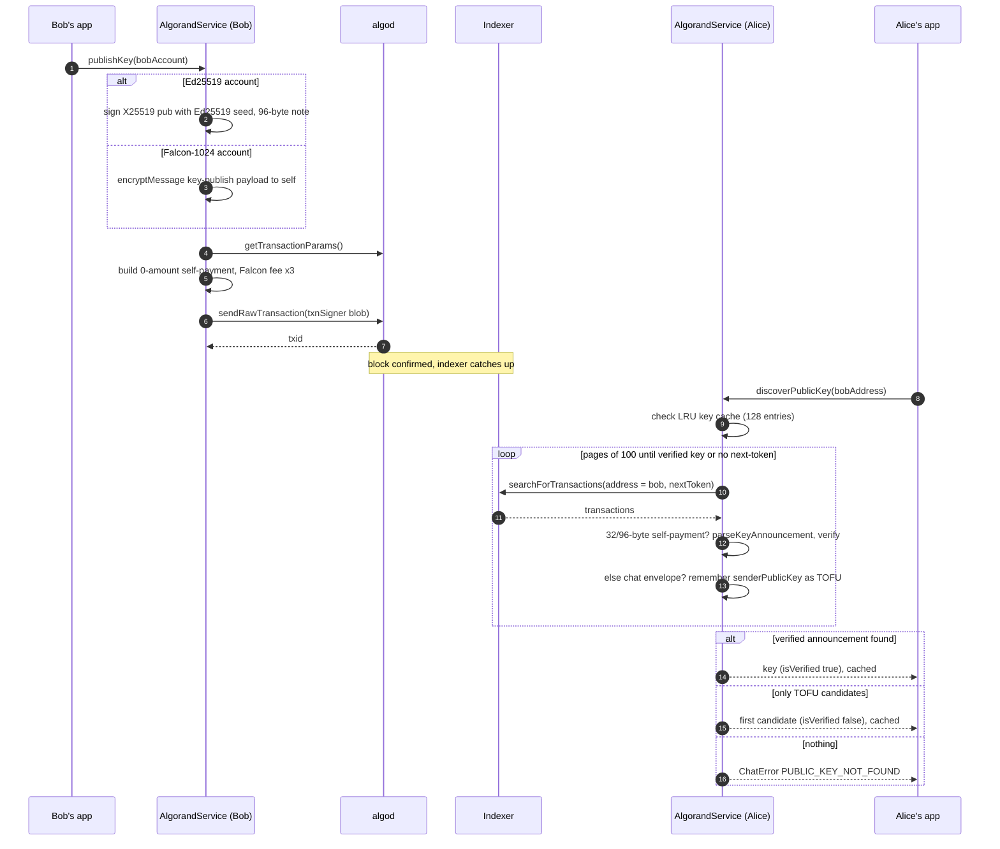

`discoverPublicKey` returns only the key bytes. `discoverPublicKeyWithMetadata` also returns `isVerified`, the transaction id, round and time, so an app can warn about unverified keys and show [`fingerprint()`](../src/crypto/signature.ts) for out-of-band comparison. The standalone [`discoverEncryptionKey`](../src/blockchain/discovery.ts) does the same over any `IndexerClient`, looking only at self-payments.

### 5.2 Send a message

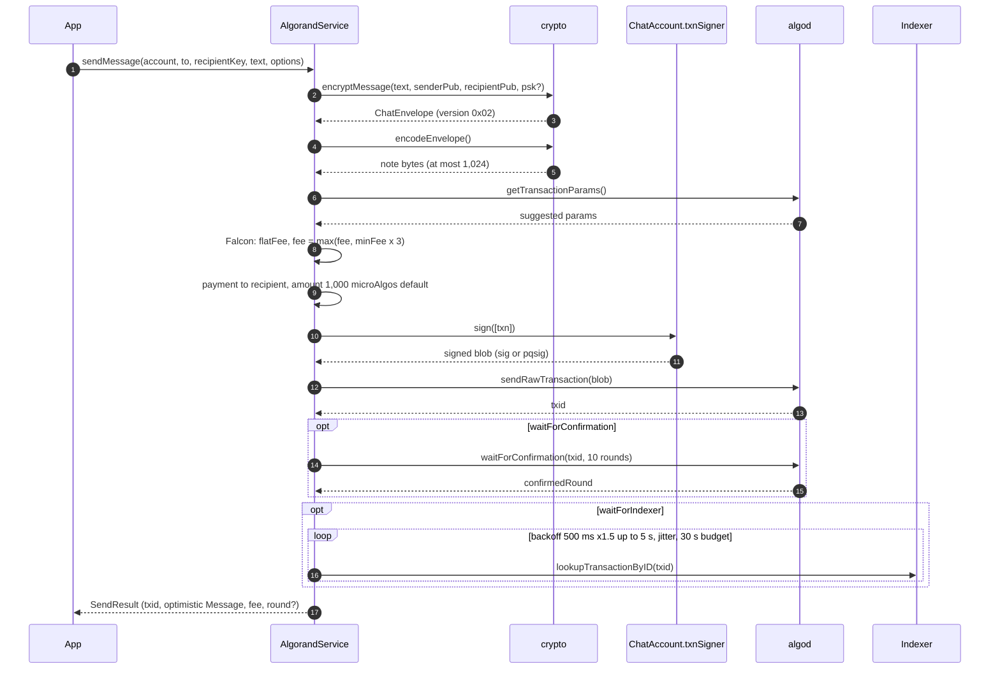

`sendReply` is the same flow with `encryptReply`. The returned `Message` is optimistic: `confirmedRound` is 0 unless the caller waited for confirmation. `SendOptionsPresets` offers `default`, `confirmed` and `indexed`.

### 5.3 Fetch and decrypt a conversation

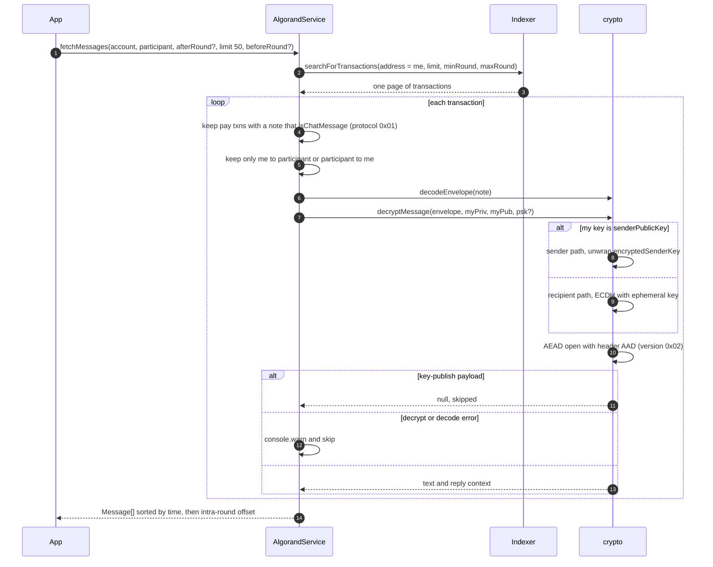

`fetchConversations(account, limit 100)` reads one page of the account's transactions and groups decrypted messages by the other party, newest conversation first. It records the other party's `senderPublicKey` from received messages as `participantPublicKey`; that key is unverified.

### 5.4 Offline queue and background sync

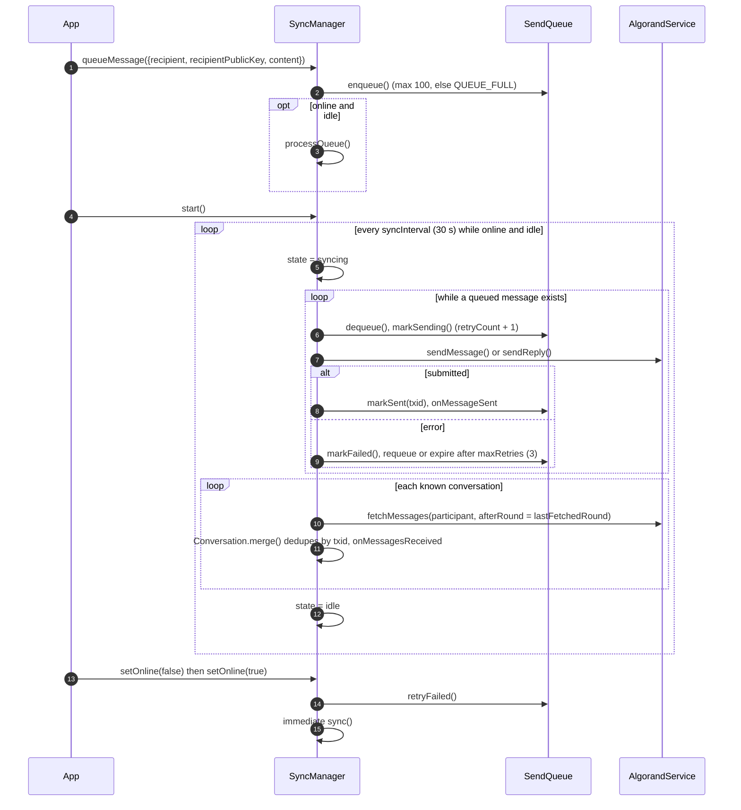

`SyncManager` only polls conversations it already knows (created by `getOrCreateConversation`, `addConversation` or a queued send). Finding new correspondents is the app's job, for example with `fetchConversations`. A `sent` queue entry means algod accepted the transaction, not that it was confirmed.

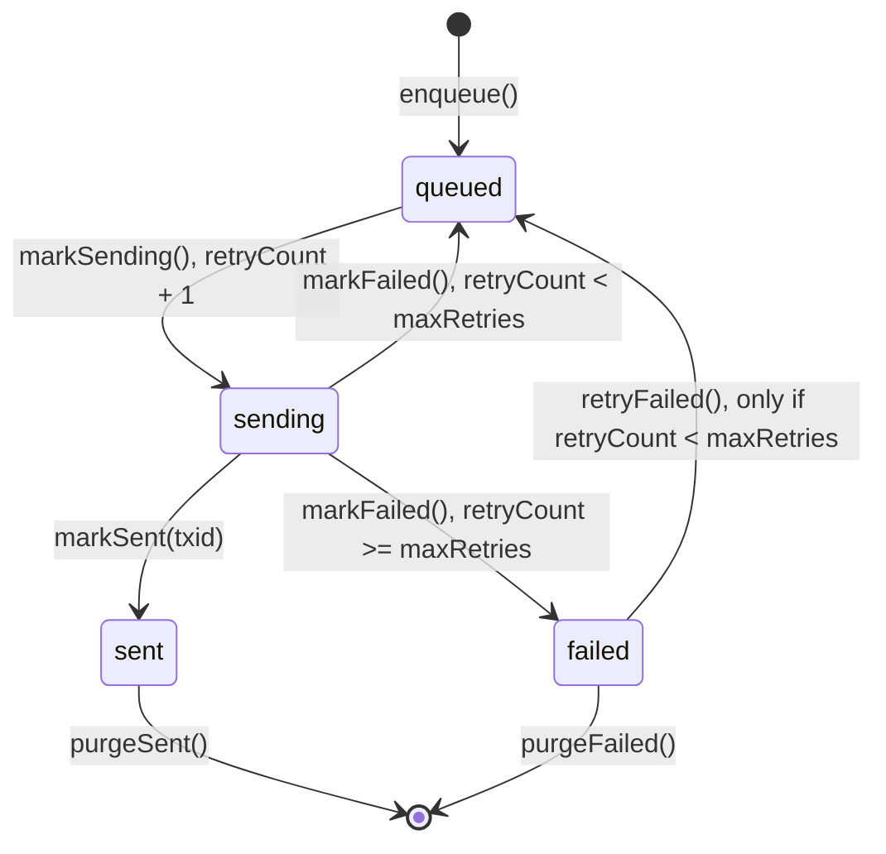

### 5.5 PSK v1.1 session

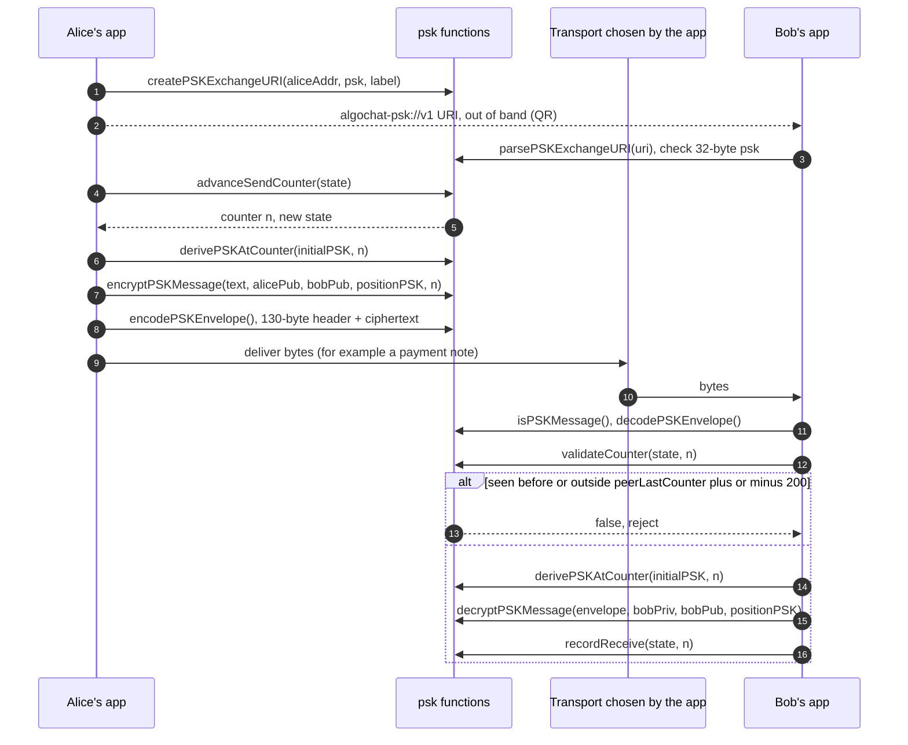

All PSK state is immutable: each call returns a new `PSKState`. Persisting it is up to the app. `seenCounters` is a `Set`, so it needs converting before JSON storage.

## 6. Data

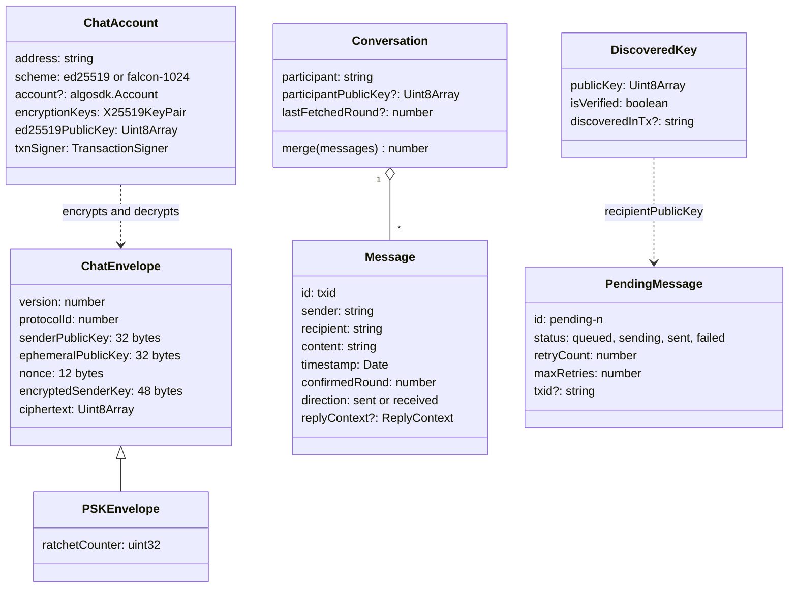

`PSKEnvelope` is drawn as an extension of `ChatEnvelope` for brevity. In the code it is a separate interface in [`psk/types.ts`](../src/psk/types.ts) with the same fields plus `ratchetCounter`.

**On-chain state.** There is no application state, box or contract. Everything is a payment transaction note:

| Note | Transaction | Written by |
|---|---|---|
| Standard envelope (`0x01` protocol) | payment sender to recipient, 1,000 microAlgos by default | `sendMessage`, `sendReply` |
| 96-byte signed announcement | 0-amount self-payment | `publishKey`, Ed25519 accounts |
| Self-encrypted `key-publish` envelope | 0-amount self-payment | `publishKey`, Falcon accounts |
| 32-byte unsigned announcement | self-payment | older clients. Still accepted as TOFU |
| PSK envelope (`0x02` protocol) | chosen by the app | the app, using `psk/` |

**Constants** ([`models/types.ts`](../src/models/types.ts), [`psk/types.ts`](../src/psk/types.ts)): `HEADER_SIZE` 126 / 130, `TAG_SIZE` 16, `ENCRYPTED_SENDER_KEY_SIZE` 48, `MAX_PAYLOAD_SIZE` 882 / 878, `MIN_PAYMENT` 1,000 microAlgos, `SESSION_SIZE` 100, `COUNTER_WINDOW` 200, `FALCON_FEE_MULTIPLIER` 3. [`conformance/vectors/00-protocol-constants.json`](../conformance/vectors/00-protocol-constants.json) pins them.

**Local storage.** The SDK never stores mnemonics. Storage is opt-in:

| Store | Where | Format |
|---|---|---|
| `InMemoryKeyStorage`, `InMemorySendQueueStorage`, `InMemoryMessageCache`, `PublicKeyCache` | process memory | plain objects. `PublicKeyCache` entries expire after 24 hours by default |
| `FileKeyStorage` (Node only) | `~/.algochat/keys/<address>.key`, directory mode 0700, file mode 0600 | salt (32) ‖ nonce (12) ‖ AES-256-GCM ciphertext (32) ‖ tag (16). Key from PBKDF2-SHA256, 100,000 iterations, of a caller-supplied password |
| `FileSendQueueStorage` (Node only) | `~/.algochat/queue.json`, mode 0600 | JSON with base64 public keys, written to a temp file then renamed |

`AlgorandService` also keeps its own in-memory LRU of discovered keys (128 entries, no expiry) until `clearKeyCache()`.

## 7. Runtime and deployment

The package is a library: it runs inside the consumer's process, with no server of its own. `tsc` compiles `src/` to ES2022 ESM with `NodeNext` resolution in `dist/` ([`tsconfig.json`](../tsconfig.json)). `package.json` requires Node.js 18 or later. The browser needs Web Crypto for `@noble/ciphers/webcrypto` randomness. `publicKeyToBase64` and `base64ToPublicKey` use `Buffer`, so browsers need a polyfill for those two helpers.

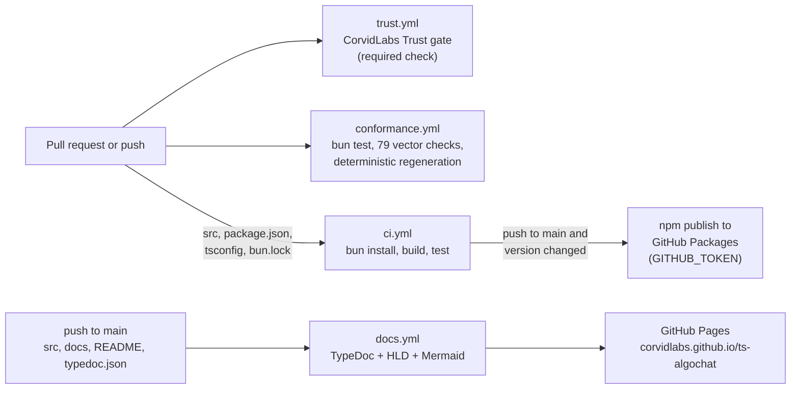

- **Local lifecycle** is defined in [`fledge.toml`](../fledge.toml): `fledge run build` (`bun run tsc`), `fledge run test` (`bun test`), `fledge run docs` (TypeDoc) and the `verify` lane (build, then test). `fledge trust verify` runs that lane, the SpecSync contract check, the Augur risk gate (`.augur.toml`: review at 35, block at 65) and provenance (`.attest.json`).
- **Release**: [`ci.yml`](../.github/workflows/ci.yml) publishes `@corvidlabs/ts-algochat` to GitHub Packages when the version in `package.json` differs from the published one. Tags such as `0.6.1` exist in the repository. **Unknown:** how GitHub Releases are cut; no release workflow is checked in.
- **Docs**: [`docs.yml`](../.github/workflows/docs.yml) builds TypeDoc from [`typedoc.json`](../typedoc.json) into `_site/`. It includes this HLD as a project document and loads [`docs/assets/mermaid.js`](assets/mermaid.js), which renders `mermaid` code blocks in the browser with Mermaid 11 from jsDelivr. The repository-root `index.html` is not part of the published site.
- **Tests**: 10 colocated `*.test.ts` files in `src/` cover crypto, signatures, discovery, indexing, the service (against a stubbed algod), mnemonics, conversations, PSK, caches and the queue. They need no network or credentials ([`specs/algochat/testing.md`](../specs/algochat/testing.md)). After a build, `bun test` also runs the compiled copies in `dist/`.

## 8. Security and trust boundaries

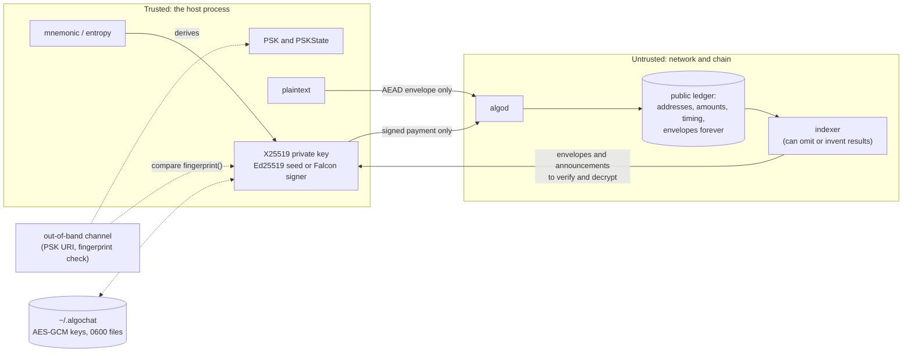

What is protected, and how:

- **Content confidentiality and integrity.** X25519 ECDH with a per-message ephemeral key, HKDF-SHA256 and ChaCha20-Poly1305 from the audited `@noble` libraries. Tampered ciphertext fails the tag check and never yields partial plaintext ([`conformance/vectors/06-negative-cases.json`](../conformance/vectors/06-negative-cases.json)).
- **Header integrity.** Version `0x02` envelopes authenticate the full fixed header as AAD, which blocks a PSK-to-standard or version downgrade ([`aad.ts`](../src/crypto/aad.ts)). The recipient path never reads `encryptedSenderKey`. On a `0x02` envelope that field is covered by the AAD. On a legacy `0x01` envelope, tampering with it only breaks the sender path ([conformance README](../conformance/README.md), note 1).
- **Key binding.** For Ed25519 accounts, a 96-byte announcement is verified against the address's Ed25519 key, and a forged one is dropped rather than accepted as unverified. Everything else, including every Falcon account and every key read from a chat envelope, is **trust on first use** and reported as `isVerified: false`. The SDK does not check transaction signatures in indexer responses, so a dishonest indexer can hide a signed announcement or supply a fake envelope. Apps should surface `isVerified` and let users compare `fingerprint()` values.
- **Account authorization.** Payments are signed through `ChatAccount.txnSigner`: Ed25519 `sig` or Falcon-1024 `pqsig`. Falcon protects the account against forged spends from a quantum adversary. It does **not** make the X25519 key exchange quantum-safe ([README, Protocol](../README.md#protocol)).
- **PSK.** Adds a second secret that an attacker needs as well as the ECDH secret. It is not forward-secret: every position key derives from the static initial PSK.
- **Secrets handling.** The SDK never persists mnemonics or logs keys or plaintext. Its only logging is `console.warn` with a transaction id or participant address and the error object, on decode, decrypt or sync failure. `FileKeyStorage` encrypts X25519 private keys at rest, and the key-storage interface carries a `requireBiometric` flag for platform implementations. `InMemoryKeyStorage` is documented as test-only. CI uses only the built-in `GITHUB_TOKEN`.

What is **not** protected ([README, Security Properties](../README.md#security-properties)):

- **Forward secrecy.** The ephemeral public key is stored on chain, so a leaked long-term X25519 key or mnemonic decrypts that account's whole history, sent and received.
- **Metadata.** Sender, recipient, amount, fee, round and envelope size are public.
- **Availability.** Delivery depends on algod accepting the transaction and on the indexer serving history.

## 9. Failure modes and limits

| Area | Limit or failure | Behavior |
|---|---|---|
| Size | Plaintext above 882 bytes (878 for PSK v1.1) | `EncryptionError` / `PSKEncryptionError` before any network call |
| Funds | Balance too low for amount + fee | algod rejects the transaction and the algosdk error propagates. `ChatErrorCode.INSUFFICIENT_FUNDS` exists, but `AlgorandService` does not pre-check balances |
| Fees | Falcon `pqsig` payments | fee raised to `max(fee, (minFee or fee) × 3)` with `flatFee` |
| Confirmation | `waitForConfirmation` (default 10 rounds) | algosdk throws if the transaction is not confirmed in time |
| Indexer lag | `waitForIndexer` (default 30 s) | backoff from 500 ms ×1.5 up to 5 s with ±20% jitter. On timeout `sendMessage` throws `ChatError` `TIMEOUT` after the transaction was already submitted |
| History depth | `fetchMessages` (limit 50) and `fetchConversations` (limit 100) read **one** indexer page of all the account's transactions, chat or not | older messages need `beforeRound` paging or `MessageIndexer.fetchOlderMessages` |
| Undecryptable notes | wrong key, wrong PSK, corruption, foreign protocol | skipped. `AlgorandService.fetchMessages` logs `console.warn`; `fetchConversations` and `MessageIndexer` skip silently |
| PSK v1.1 notes | protocol `0x02` | ignored by `AlgorandService` and `MessageIndexer` (see 4.3) |
| Key discovery | long histories | exhaustive paging at 100 per request unless `searchDepth` is set. The result is cached without expiry, so a rotated key is not seen until `clearKeyCache()` |
| Discovery miss | no announcement or envelope | `ChatError` `PUBLIC_KEY_NOT_FOUND` |
| Round filters | indexer `minRound` is inclusive | `SyncManager` re-reads the last round, and `Conversation.merge` drops duplicates by txid |
| Queue | more than 100 pending (default) | `ChatError` `QUEUE_FULL` |
| Retries | failures past `maxRetries` (3) | status `failed`. `SendQueue` fires `onMessageExpired`, which `SyncManager` reports as `onMessageFailed`. `retryFailed()` only requeues failed entries still under their budget |
| Replay (PSK v1.1) | counter already seen or more than 200 from `peerLastCounter` | `validateCounter` returns `false`. Messages older than the window become unreadable through this check |
| Errors | protocol vs service | decoders throw typed `EnvelopeError` / `PSKEnvelopeError`. AEAD failures surface as a generic `Error` from `@noble/ciphers`. Service code uses `ChatError` with a `ChatErrorCode` |

## 10. Decisions

The design record lives in SpecSync rather than a DECISIONS file:

- [`specs/algochat/algochat.spec.md`](../specs/algochat/algochat.spec.md): the contract: public API, 12 invariants, error cases.
- [`specs/algochat/context.md`](../specs/algochat/context.md): design decisions.
- [`specs/algochat/requirements.md`](../specs/algochat/requirements.md): `REQ-algochat-*` acceptance criteria.
- `.specsync/archive/changes/`: accepted change records, including [CHG-0007 Falcon-default accounts](../.specsync/archive/changes/2026-08-27-CHG-0007-falcon-default-chataccounts/design.md) and [removal of the raven mailbox transport](../.specsync/archive/changes/2026-09-20-remove-the-raven-mailbox-router-transport-and-keep-algochat-as-encrypted-note-messaging-with-falcon-1024-post-quantum/design.md).
- [`conformance/README.md`](../conformance/README.md): how the vectors are made, and why they are append-only.

The decisions that shape the design:

1. **Payment notes are the only transport.** No mailbox contract or relay. This keeps the protocol simple and interoperable. It also makes metadata public and ties message size to the 1,024-byte note.
2. **Per-message ephemeral ECDH with a sender-wrapped key.** Each message has its own key, and senders can re-read their history from chain alone. Because the ephemeral public key is on chain, this gives no forward secrecy, and the README says so plainly.
3. **PSK is added to ECDH through HKDF, not in place of it.** An attacker needs both secrets.
4. **One signing path for two schemes.** `txnSigner` hides whether the account signs with Ed25519 or Falcon-1024. New accounts default to Falcon. Imports default to Ed25519 so existing phrases keep their addresses.
5. **Encryption keys come from mnemonic entropy.** The same words give the same X25519 key under either scheme.
6. **Authenticate the header and bind announced keys (0.6.1).** Envelope version `0x02` adds header AAD. Ed25519 accounts publish signed announcements, and discovery rejects forged ones. Legacy `0x01` still decrypts.
7. **Injectable boundaries.** Blockchain interfaces, storage and caches are interfaces, so the protocol can be tested offline and ported to other SDKs.
8. **Conformance vectors are append-only.** A changed deterministic byte is a protocol change and needs a version bump.

## 11. Glossary

| Term | Meaning |
|---|---|
| algod | The Algorand node REST API: fetches transaction parameters, accepts signed transactions and reports confirmation. |
| Indexer | The Algorand service that answers queries over historical transactions. |
| Note | The free-form field, up to 1,024 bytes, on an Algorand transaction. It carries the envelope. |
| Round | An Algorand block height. `confirmedRound` orders messages. |
| microAlgo | One millionth of an Algo. The default message payment is 1,000. |
| Envelope | The binary AlgoChat message: header plus ciphertext. |
| X25519 / ECDH | The elliptic-curve Diffie-Hellman key agreement used for encryption keys. |
| HKDF | HMAC-based key derivation (here with SHA-256). |
| AEAD / AAD | Authenticated encryption, and the associated data it authenticates without encrypting. Here: ChaCha20-Poly1305 with the envelope header as AAD. |
| Ephemeral key | A key pair generated for one message and then discarded (only its public half is kept, in the envelope). |
| Bidirectional decryption | The sender can decrypt its own messages via `encryptedSenderKey`. |
| Key announcement | A self-payment whose note publishes an X25519 public key, signed (96 bytes) or unsigned (32 bytes). |
| TOFU | Trust on first use: accepting a key without cryptographic proof of ownership. |
| PSK | Pre-shared key: a 32-byte secret exchanged out of band. |
| Ratchet counter | The per-message counter in PSK v1.1 that selects the session and position keys. |
| `sig` / `pqsig` | The Algorand transaction signature fields for Ed25519 and for post-quantum (Falcon-1024) signatures. |
| Falcon-1024 | A lattice-based post-quantum signature scheme. |
| Fingerprint | The first 8 bytes of SHA-256 of a public key, in hex groups, for people to compare. |
